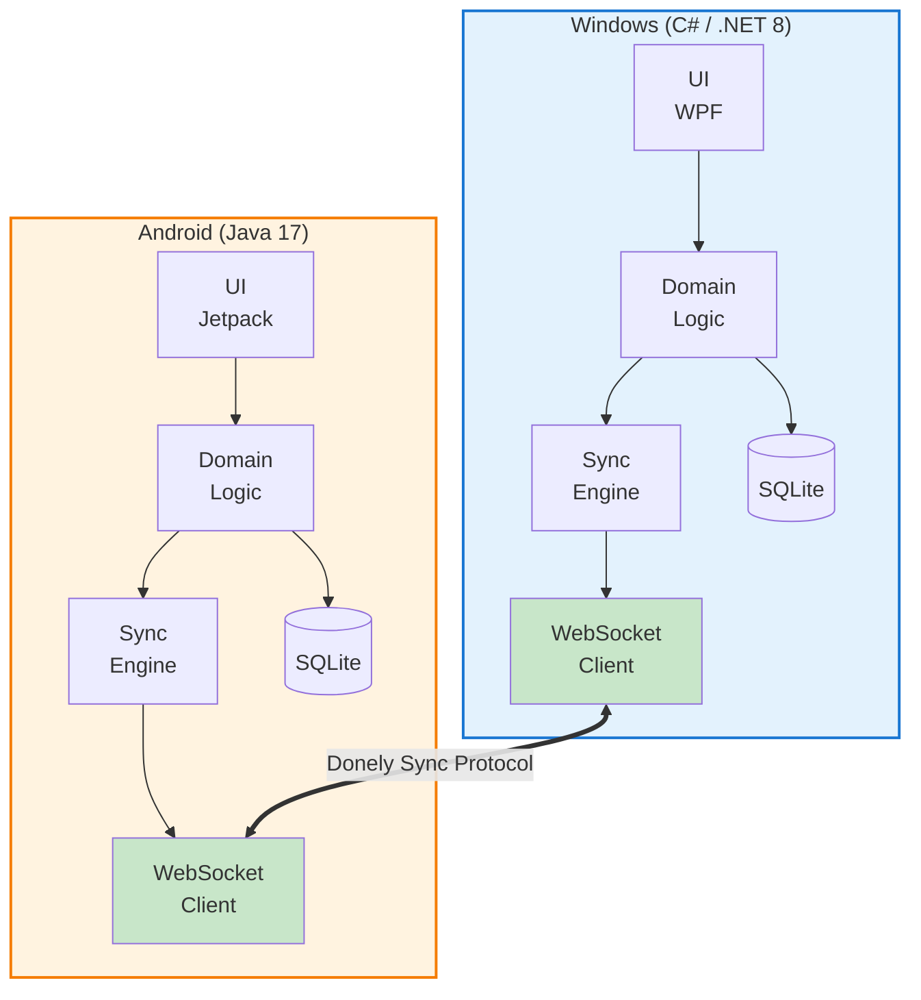

<div align="center">

# Donely

**The task manager that gets things *done* — even offline.**

A cross-platform task manager that synchronizes between Windows and Android devices
**directly, without a server, without the internet, and without compromise.**

[](https://opensource.org/licenses/MIT)
[]()
[]()
[]()
[]()

> ⚠️ **Donely is under active development.** The first stable release
> (`v0.1.0`) is planned. APIs and data models may change without notice.

</div>

---

## 📖 Table of Contents

- [Why Donely?](#-why-donely)
- [Features](#-features)
- [Architecture](#-architecture)
- [Tech Stack](#-tech-stack)
- [Synchronization Model](#-synchronization-model)
- [Project Structure](#-project-structure)
- [Roadmap](#-roadmap)
- [Documentation](#-documentation)
- [Getting Started](#-getting-started)
- [Contributing](#-contributing)
- [License](#-license)

---

## 💡 Why Donely?

Most task managers today assume you have:
- A **server** running somewhere.
- An **internet connection** at all times.
- A **cloud account** you trust with your data.

But sometimes you don't — you're on a plane, in a remote area, or you simply
value your privacy. You still need to keep your tasks in sync between your laptop
and your phone.

**Donely solves this by syncing directly between your devices over the local
network — no server, no cloud, no compromise.**

> *Donely — because the best task manager is the one that gets things **done**.*

---

## ✨ Features

### Core (v1.0)
- ✅ Create, edit, delete, and organize tasks
- ✅ Tags and priorities
- ✅ Local-first storage (SQLite) on every device
- ✅ Automatic device discovery on the same Wi-Fi network
- ✅ Bidirectional synchronization
- ✅ Conflict resolution using **Vector Clocks**
- ✅ Full Arabic (RTL) and English (LTR) support

### Planned (v2.0+)
- 🔄 Multi-device mesh sync (more than 2 devices)
- 🔄 QR-code pairing
- 🔄 Bluetooth fallback when no Wi-Fi is available
- 🔄 Version history and conflict review UI
- 🔄 End-to-end encryption

---

## 🏗 Architecture

Donely is built as **two independent applications** (C# and Java) that
communicate through a **shared protocol** — the `Donely Sync Protocol`.



The **protocol is the contract** between the two applications. It is
documented in [`docs/PROTOCOL.md`](docs/PROTOCOL.md) and can be extended
to support additional platforms in the future.

---

## 🧰 Tech Stack

| Layer                | Windows (C#)           | Android (Java)          |
|----------------------|------------------------|-------------------------|
| Language             | C# 12 / .NET 8         | Java 17                 |
| UI Framework         | WPF (or .NET MAUI)     | Jetpack Compose         |
| Local Storage        | SQLite (EF Core)       | SQLite (Room)           |
| Networking           | `System.Net.WebSockets`| `OkHttp WebSocket`      |
| Discovery            | mDNS (`Makaretu.Dns`)  | NSD (Network Service Discovery) |
| Sync Model           | Vector Clocks + Op Log | Vector Clocks + Op Log  |
| Testing              | xUnit                  | JUnit                   |
| CI/CD                | GitHub Actions         | GitHub Actions          |

---

## 🔄 Synchronization Model

Donely treats synchronization as a **stream of operations**, not as direct
database writes. Every change to a task produces an **Operation** with:

- A unique ID
- The originating device
- A **Vector Clock** for causal ordering
- A timestamp

When two devices connect, they exchange the operations they haven't seen,
then apply them. In case of **concurrent edits**, Donely uses
**Last-Write-Wins** with full history preservation — so no data is ever
silently lost.

> See [`docs/PROTOCOL.md`](docs/PROTOCOL.md) for the full specification.

---

## 📁 Project Structure

```
donely/
├── docs/                     # Design & specification documents
│   ├── SCOPE.md
│   ├── PROTOCOL.md
│   ├── ARCHITECTURE.md
│   └── DATA_MODEL.md
├── windows-csharp/           # Windows application (.NET 8, C#)
│   ├── src/
│   │   ├── Donely.Core/      # Domain + Sync Engine
│   │   ├── Donely.Data/      # SQLite persistence
│   │   ├── Donely.Network/   # WebSocket + mDNS
│   │   └── Donely.UI/        # WPF interface
│   └── tests/
├── android-java/             # Android application (Java 17)
│   ├── app/
│   ├── core/
│   ├── data/
│   └── network/
├── shared/                   # Shared protocol schemas
│   └── protocol-schema.json
├── .github/workflows/        # CI/CD pipelines
├── README.md
└── LICENSE
```

---

## 🗺 Roadmap

| Milestone | Goal                                              | Status         |
|-----------|---------------------------------------------------|----------------|
| **M1**    | Standalone apps with local CRUD + SQLite          | 🚧 In Progress |
| **M2**    | Device discovery + WebSocket communication        | ⏳ Planned     |
| **M3**    | Sync engine + Vector Clocks + conflict resolution | ⏳ Planned     |
| **M4**    | Tests, Arabic UI, packaging, and release          | ⏳ Planned     |

---

## 📚 Documentation

| Document | Description |
|---|---|
| [`docs/SCOPE.md`](docs/SCOPE.md)               | Project scope, goals, and out-of-scope items |
| [`docs/PROTOCOL.md`](docs/PROTOCOL.md)         | The Donely Sync Protocol specification |
| [`docs/ARCHITECTURE.md`](docs/ARCHITECTURE.md) | System architecture and component design |
| [`docs/DATA_MODEL.md`](docs/DATA_MODEL.md)     | Entities, schema, and data flow |

---

## 🚀 Getting Started

> ⚠️ Donely is currently under active development. Setup instructions
> will be published with the first release (v0.1.0).

For now, you can explore the design documents in the [`docs/`](docs/) folder.

---

## 🤝 Contributing

Donely is a solo learning project, but feedback is very welcome.
If you find a bug or have a suggestion, please open an
[issues](https://github.com/Basel-Boukhari/donely/issues).

---

## 📄 License

This project is licensed under the **MIT License** — see the
[LICENSE](LICENSE) file for details.

---

<div align="center">

**Donely** — *Get things done. Offline.*

</div>
